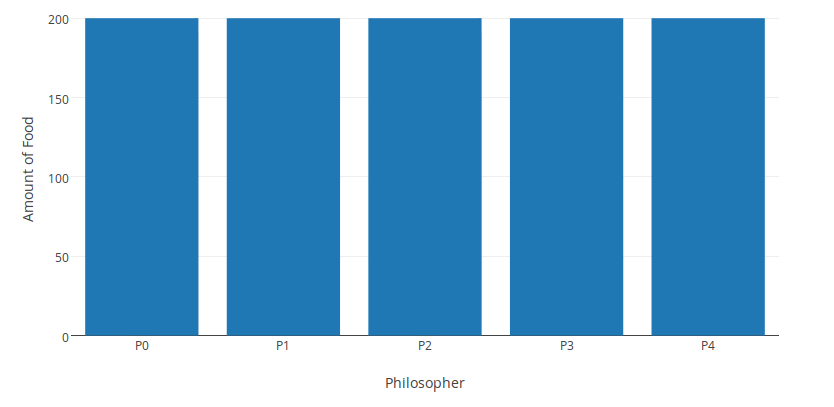
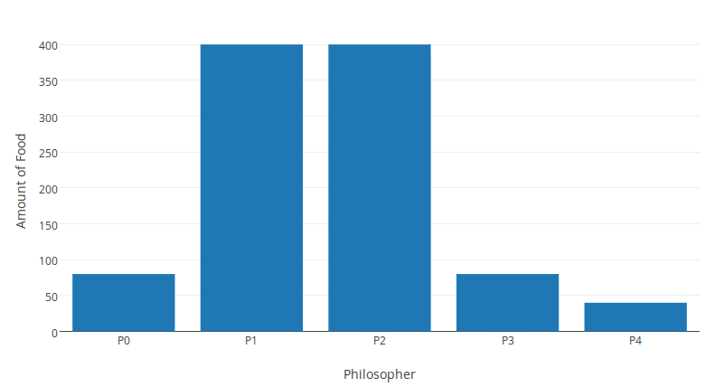
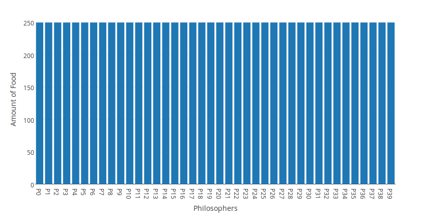
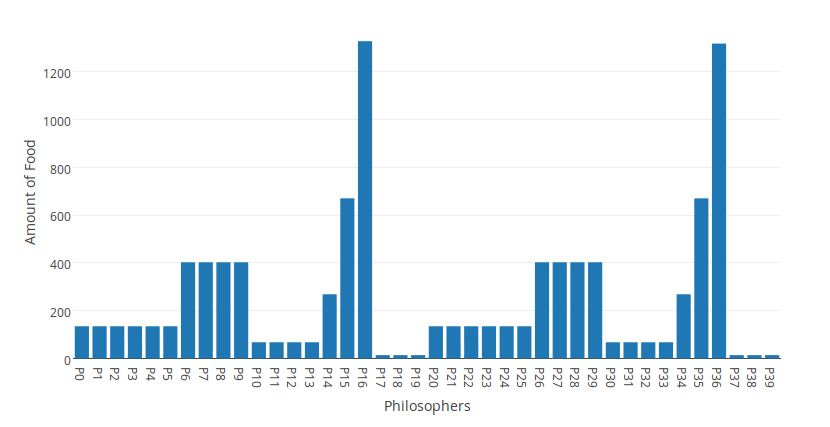

% Relatório EP3 - Prog. Concorrente
% Ciro S. Costa - 8071488
% Seg, 22 Jun, 2015

# EP3

Neste EP buscou-se simular o problema dos *Filósofos Famintos* através do uso de Monitores. Esta implementação foi feita em C++ utilizando a biblioteca padrão `thread` para o manuseio de variáveis de condição e `mutex`.

O Monitor está implementado em `src/lib/Food.hpp`, o qual trata de restringir o acesso à comida disponível no banquete através do controle dos garfos. Como, segundo o enunciado, para que o filósofo possa comer ele deve obter dois garfos, sendo estes os recursos compartilhados, foi implementado o monitor de tal forma para que conseguíssemos garantir que mais de um filósofo comesse ao mesmo tempo (ao contrário de uma possível implementação a qual encapsularia o ato de comer em um Monitor). Cada garfo possui então uma variável que indica se o mesmo está sendo usado e também uma variável de condição associada.

## Casos

Para cada caso os resultados foram descritos por meio de:
Gráfico:
- barras
- x: identificador de cada filósofo
- y: quantidade de porções comida

Verificação do resultado esperado:
- no modo U (uniforme), barras do gráfico fossem uniformes
- no modo P (pesos), não uniforme, barras do gráfico fossem proporcionais aos pesos

### Arquivos Testes

Dois foram os arquivos utilizados como testes: um com poucos filósofos (e poucos pesos, portanto) e outro com vários filósofos (vários pesos diferentes). Para o primeiro arquivo não precisamos de "muita comida" para atingirmos o estado desejado (distribuição como esperada), enquanto no segundo, sim.

- `assets/poucos.txt`:

```
5
10 50 50 10 5
```

- `assets/muitos.txt`:

```
40
10 10 10 10 10 10 30 30 30 30 5 5 5 5 20 50 100 1 1 1 10 10 10 10
10 10 30 30 30 30 5 5 5 5 20 50 100 1 1 1
```

### 1. Entrada simples (poucos), U
```sh
$ ./dinnp ./assets/poucos.txt 1000 U

P0,200; P1,200; P2,200; P3,200; P4,200;
```

Para a entrada simples (com 5 filósofos) com pesos uniformes, espera-se obter a solução como observada em aula: os 5 filósofos conseguem comer quantidades iguais e nenhum morre de fome. Com pequeno número de comida conseguimos atingir o resultado desejado.




### 2. Entrada simples (poucos), P
```sh
$ ./dinnp ./assets/poucos.txt 1000 P

P0,80; P1,400; P2,400; P3,80; P4,40;
```



### 3. Entrada Complexa (muitos), U
```sh
$ ./src/dinnp ../assets/muitos.txt 10000 U

P0,250; P1,250; P2,250; P3,250; P4,250; P5,250; P6,250; P7,250; P8,250; P9,250;
P10,250; P11,250; P12,250; P13,250; P14,250; P15,250; P16,250; P17,250; P18,250;
P19,250; P20,250; P21,250; P22,250; P23,250; P24,250; P25,250; P26,250; P27,250;
P28,250; P29,250; P30,250; P31,250; P32,250; P33,250; P34,250; P35,250; P36,250;
P37,250; P38,250; P39,250;
```




### 4. Entrada Complexa (muitos), P
```sh
$ ./dinnp ./assets/muitos.txt 10000 P

P0,135; P1,135; P2,135; P3,135; P4,135; P5,135; P6,403; P7,403; P8,403; P9,403;
P10,68; P11,68; P12,68; P13,68; P14,269; P15,671; P16,1329; P17,14; P18,14;
P19,14; P20,135; P21,135; P22,135; P23,135; P24,135; P25,135; P26,403; P27,403;
P28,403; P29,403; P30,68; P31,68; P32,68; P33,68; P34,269; P35,671; P36,1319;
P37,14; P38,14; P39,14;
```




